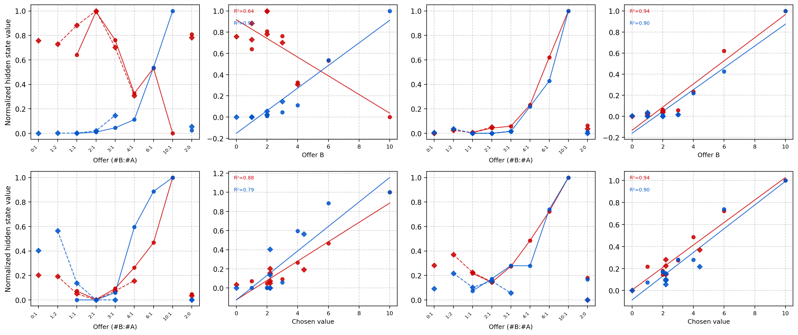

# Bioinspired RNN Models for Time-Dependent RL Tasks

Code, data and trained agents for the article

> I. Martínez and C. M. Alaíz, *Bioinspired RNN Models for Time-Dependent RL Tasks*.

An actor–critic agent trained with REINFORCE is built on a **bioinspired
(modified) GRU**: continuous-time leaky dynamics, a leak gate and a
threshold-linear (ReLU) output, so that hidden states can be read as firing
rates. The agent is compared with a feedforward network (FFNN) and a standard
GRU network on CartPole, on the economic choice task of Padoa-Schioppa & Assad
(2006), and on variants of both in which the agent must remember information
that is no longer observable. The hidden units of the trained networks are then
classified by the economic variable they encode, as in the original
neurophysiology experiments.

Every figure and number in the results section of the paper can be regenerated
from this repository with one command (see [Reproducing the paper](#reproducing-the-paper)).

## Contents

```
├── src/bioinspired_rnn/      Python package
│   ├── modified_gru.py       modified GRU cell and Keras layer
│   ├── actor_critic.py       actor and critic networks, agent
│   ├── sparse_constraint.py  fixed random sparsity of the connections
│   ├── reinforce.py          REINFORCE with baseline (training loop)
│   ├── checkpoints.py        saving / restoring agents between stages
│   ├── training.py           runs the curriculum stages of a configuration
│   ├── recording.py          records the activity of a trained agent
│   ├── envs/                 Economic Choice task and partial CartPole
│   └── analysis/             learning curves, psychometric curves, neuron
│                             classification and figures (no TensorFlow needed)
├── configs/                  one file per training run of the paper
├── data/                     training results and recorded activity
├── checkpoints/              trained agents (last stage of every run)
├── scripts/
│   ├── reproduce_paper.py    figures and tables of the paper, from data/
│   ├── extract_data.py       raw training outputs -> data/
│   ├── record_activity.py    trained agents -> data/neural/
│   ├── train.py              trains a run
│   └── evaluate.py           runs a trained agent
├── figures/                  generated figures (+ schematics/ of Figs. 1-2)
├── results/                  generated tables
└── tests/
```

## Installation

Python ≥ 3.11. The analysis only needs NumPy, SciPy, pandas and Matplotlib;
training also needs TensorFlow, Keras 3 and Gymnasium.

```bash
python -m venv .venv
source .venv/bin/activate        # Windows: .venv\Scripts\activate
pip install -e .                 # analysis only
pip install -e ".[train,dev]"    # + training and tests
```

`requirements.txt` pins the exact versions with which the results were
verified (Python 3.12, TensorFlow 2.20, Keras 3.11, Gymnasium 1.1).

## Reproducing the paper

```bash
python scripts/reproduce_paper.py
```

reads `data/` and writes the figures to `figures/` and the tables to
`results/` in a few seconds. The neural activity in `data/neural/` is itself
generated from the trained agents in `checkpoints/` by
`python scripts/record_activity.py` (needs TensorFlow).

| Paper | Output | Code |
|---|---|---|
| Fig. 1 (GRU diagrams) | `figures/schematics/fig1*` | schematic; equations in `modified_gru.py` |
| Fig. 2 (task observables) | `figures/schematics/fig2*` | schematic of `envs/economic_choice.py` |
| Fig. 3a, 3b (CartPole learning curves) | `figures/fig3a_cartpole.pdf`, `figures/fig3b_cartpole_partial.pdf` | `analysis.plots.learning_curves` |
| Fig. 4a, 4b (psychometric curves) | `figures/fig4*_psychometric_*.pdf`, `results/psychometric.csv` | `analysis.behaviour.psychometric` |
| Fig. 5 (representative units) | `figures/fig5_representative_neurons.pdf`, `results/fig5_exemplars.csv` | `analysis.neurons`, `analysis.plots.representative_neurons` |
| Table 1 (units per type) | `results/table1_neuron_types.csv`, `results/neuron_classification.csv` | `analysis.neurons.type_counts` |
| Offer A vs Offer B slopes (Sec. 4.2) | `results/rank_sum_offer_A_vs_B.csv` | `analysis.neurons.offer_slopes_rank_sum` |
| Training episodes and learning speed (Sec. 4) | `results/training_summary.csv` | `scripts/reproduce_paper.py` |

`pytest tests/test_reproduction.py` checks the numbers of Table 1, the units of
Fig. 5 and the episodes of every run against the paper.

### Expected results

Table 1, number of critic units (out of 50) of each type:

| | Full, standard RNN | Full, modified RNN | Partial, standard RNN | Partial, modified RNN |
|---|---:|---:|---:|---:|
| Offer value A | 0 | 2 | 0 | 1 |
| Offer value B | 14 | 10 | 18 | 5 |
| Chosen value | 20 | 1 | 28 | 10 |
| *Unclassified* | *14* | *5* | *3* | *0* |
| *Inactive* | *2* | *32* | *1* | *34* |

Only the modified RNNs have Offer value A units. As in Padoa-Schioppa (2009),
their absolute slopes are larger than those of the Offer value B units, and
the two groups are completely separated, the most extreme outcome of the
Wilcoxon rank-sum test for these sample sizes
(`results/rank_sum_offer_A_vs_B.csv`):

| Modified RNN | Offer A vs Offer B units | Exact p | Minimum attainable p |
|---|---:|---:|---:|
| Full | 2 vs 10 | 0.030 | 0.030 |
| Partial | 1 vs 5 | 0.33 | 0.33 |
| Both environments | 3 vs 15 | 0.0025 | 0.0025 |

Since the tuning curves are Min–Max normalised, the slope of a linearly tuned
unit is close to the inverse of the range of its variable (0–2 drops of A,
0–10 drops of B), which explains the difference.

CartPole (Fig. 3a): the 70-episode moving average first reaches 200 at episode
195 (standard RNN), 302 (FFNN) and 446 (modified RNN).



## Method in brief

**Networks.** Actor and critic are `Dense(ReLU) → hidden layer → Dense`. The
hidden layer has 50 units (100 in the partial-CartPole modified RNN) and is
either a ReLU dense layer (FFNN), a Keras GRU (standard RNN) or the modified
GRU, with α = Δt/τ = 0.1:

```
λ_t = σ(W_λ,rec h_{t-1} + W_λ,in x_t + b_λ)          leak gate
γ_t = σ(W_γ,rec h_{t-1} + W_γ,in x_t + b_γ)          recurrent gate
h̃_t = W_rec (γ_t ⊙ h_{t-1}) + W_in x_t + b
h_t = ReLU(h_{t-1} + α λ_t ⊙ (h̃_t − h_{t-1}))
```

Only 10 % of the input and recurrent connections of the actor's hidden layer
are kept (fixed random mask); the critic is dense. The actor outputs action
probabilities; the critic receives the actor's hidden state and the one-hot
action and outputs the value baseline.

**Training.** REINFORCE with baseline, one update per episode, Adam (learning
rate 0.004; 0.001 for the standard RNN in the partial Economic Choice task),
L2 penalty 10⁻⁴, gradient clipping at global norm 1, no
discounting (γ = 1, except 0.95 for the partial-CartPole modified RNN). The
Economic Choice agents follow a curriculum that starts with 10–20 ms epochs and
lengthens them up to the original durations (fixation 1.5 s, offer 1–2 s,
decision ≤ 2 s, 10 ms steps); `configs/` lists every stage.

**Unit classification** (`analysis/neurons.py`). Each trained Economic Choice
RNN plays 500 trials of the original task with its weights fixed
(`scripts/record_activity.py`). The hidden state of every critic unit is
averaged over the last 100 steps of each completed trial (≈ the last second of
the offer period, since the agents choose within the first steps of the
decision period) and then over the trials of each *trial type* (offer and
juice chosen), as in Padoa-Schioppa & Assad (2006). The resulting tuning curve
is Min–Max normalised and regressed on offer value A (#A), offer value B (#B)
and chosen value (value of the juice chosen, in units of B). Units whose tuning
curve spans less than 0.001 are considered inactive; an active unit takes the
variable with the highest R² among those with a significant slope (p < 0.05),
and is unclassified otherwise.

## Training

```bash
python scripts/train.py EC_F_rnn                   # whole run
python scripts/train.py EC_F_rnn --stages 5-9      # resume from runs/Checkpoints/EC_F_rnn_4
python scripts/train.py CP_F_rnn --max-episodes 5  # quick test
```

Outputs go to `runs/Outputs/<run>_<stage>.pkl` (rewards, losses, hidden states
of every episode and trial records) and `runs/Checkpoints/<run>_<stage>/`, the
layout expected by `scripts/extract_data.py --raw-dir runs/Outputs`. Training
processes one time step at a time in eager mode, so the long Economic Choice
runs take many hours on a CPU. Reinforcement-learning training is stochastic:
retraining gives statistically similar, not identical, results.

The raw outputs of the paper's runs (about 6.5 GB) are not stored here; they
are available from the authors on request. `data/` contains everything the
analysis needs, and `data/sources.csv` lists the raw files it was extracted
from.

## Trained agents

`checkpoints/` holds the agent at the end of every run. For example,

```bash
python scripts/evaluate.py EC_F_rnn --episodes 500
```

plays 500 trials with the trained modified RNN and prints its psychometric
table. See `checkpoints/README.md` to load an agent in Python.

> **Windows:** TensorFlow cannot open checkpoints whose path contains non-ASCII
> characters. `evaluate.py` works around it by reading a temporary copy; when
> training, use an output directory with an ASCII-only path.

## Tests

```bash
pytest
```

Unit tests of the environments, the modified GRU equations and the analysis,
a short two-stage training run of each kind of agent (skipped without
TensorFlow), and the reproduction checks described above.

## Citation

If you use this code, please cite the article above; citation metadata for the
repository are in [`CITATION.cff`](CITATION.cff).

## Authors and license

Iñigo Martínez (imartinezc@estudiante.uam.es) and Carlos M. Alaíz
(carlos.alaiz@uam.es), Universidad Autónoma de Madrid.

Released under the [MIT License](LICENSE).
